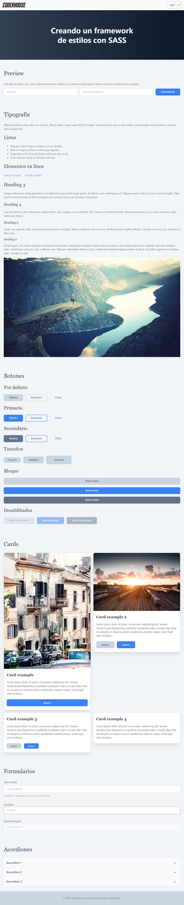
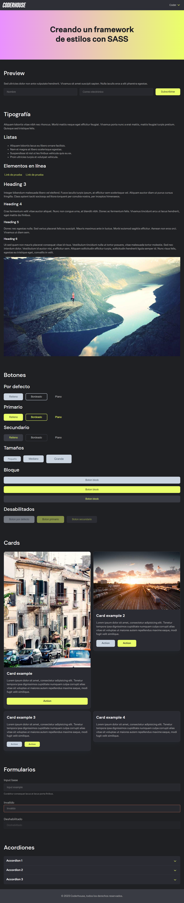

# Coderhouse SASS Framework

Creación de framework propio con SASS

## Comandos

```sh
npm install   # Instala todas las dependencias del proyecto

npm run dev   # Inicia servidor de desarrollo con `Hot Reloading`
npm run build # Crea una version minificada lista para produccion en la carperta `dist/`
```

## Variables `CSS` disponibles

```scss
:root {
  // FONT
  --coder-font-primary: Inter var, ui-sans-serif, system-ui, -apple-system, BlinkMacSystemFont, "Segoe UI", Roboto, "Helvetica Neue", Arial, "Noto Sans", sans-serif, "Apple Color Emoji", "Segoe UI Emoji", "Segoe UI Symbol", "Noto Color Emoji";
  --coder-font-secondary: ui-serif, Georgia, Cambria, "Times New Roman", Times, serif;

  --coder-font-size-base: 16px;
  --coder-font-weight-base: 400;
  --coder-line-height-base: 1.5;

  // COLORS
  --coder-body-bg-color: #f1f5f9
  --coder-body-text-color: #64748b;
  --coder-heading-text-color: #334155;

  --coder-color-primary: #3b82f6;
  --coder-color-primary-hover: #60a5fa;
  --coder-color-primary-contrast: #eff6ff;

  --coder-color-secondary: #64748b;
  --coder-color-secondary-hover: #94a3b8;
  --coder-color-secondary-contrast: #f8fafc;

  --coder-color-focus: #94a3b8;

  --coder-shadow-color: 51 65 85;

  // HEADER
  --coder-header-bg-color: #f8fafc;
  --coder-header-border-color: #e2e8f0;

  // HERO
  --coder-hero-text-color: #f1f5f9;
  --coder-hero-gradient-start: #334155;
  --coder-hero-gradient-end: #0f172a;

  // FOOTER
  --coder-footer-bg-color: #e2e8f0;
  --coder-footer-text-color: #64748b;

  // ACCORDIONS
  --coder-accordion-title-color: #475569;
  --coder-accordion-title-bg: #f8fafc;
  --coder-accordion-title-hover-bg: #f1f5f9;
  --coder-accordion-title-border: #e2e8f0;
  --coder-accordion-content-bg: #FFFFFF;

  // BUTTONS
  --coder-btn-radius: 8px;

  // CARDS
  --coder-card-bg: #FFFFFF;
  --coder-card-radius: 12px;
  --coder-card-border: #e2e8f0;

  // INPUTS
  --coder-input-bg-color: #FFFFFF;
  --coder-input-text-color: #64748b;
  --coder-input-border-color: #cbd5e1;
  --coder-input-focus-border-color: #94a3b8;
  --coder-input-invalid-color: #f87171;

  // SELECT
  --coder-select-bg-color: #f8fafc;
  --coder-select-hover-color: #FFFFFF;
  --coder-select-text-color: #64748b;
  --coder-select-border-color: #94a3b8;
  --coder-select-focus-color: #64748b;

  // UTILS
  --coder-chevron: url("data:image/svg+xml, <svg xmlns='http://www.w3.org/2000/svg' width='24' height='24' viewBox='0 0 24 24' fill='none' stroke='rgb(100, 116, 139)' stroke-width='2' stroke-linecap='round' stroke-linejoin='round'><polyline points='6 9 12 15 18 9'></polyline></svg>");
}
```

> ⚠️ El prefijo **`coder`** usado en todas las variables `CSS` puede ser cambiado facilmente sobreescribiendo la variable global SCSS **`$prefix`**


## Clases `utiles` disponibles

```html
<!-- CONTENEDORES -->
<div class="container"></div>
<div class="flex-container"></div>

<!-- APLICA ESTILOS CON TRANSICIONES A TODOS LOS HIJOS -->
<body class="animate-all"></body>

<!-- `margin` EN TODAS LAS DIRECCIONES DEL `0` AL `16` -->
<div class="m-0"></div>
<div class="mt-8"></div>
<div class="my-4"></div>
<div class="mx-auto"></div>

<!-- `padding` EN TODAS LAS DIRECCIONES DEL `0` AL `16` -->
<div class="p-0"></div>
<div class="pt-8"></div>
<div class="py-4"></div>
<div class="px-auto"></div>
```


## `Mixins` utiles disponibles

```SCSS
// GENERA UNA VARIACION DE COLOR PARA BOTONES
@include btnColorVariation($class, $color, $color-light, $color-contrast);


// GENERA UN SELECTOR PADRE CON EL ATRIBUTO `data-theme`
@include theme($theme) {
  // ...
}


// GENERA UN MEDIA QUERY CON EL BREAKPOINT SELECCIONADO
@include break-up($breakpoint) {
  // ...
}

// ATAJO O ALIAS PARA `breakup(sm)`
@include sm() {
  // ...
}
// ATAJO O ALIAS PARA `breakup(md)`
@include md() {
  // ...
}
// ATAJO O ALIAS PARA `breakup(lg)`
@include lg() {
  // ...
}
// ATAJO O ALIAS PARA `breakup(xl)`
@include xl() {
  // ...
}


// GENERA CLASES UTILITARIAS PARA ESPACIADOS
@include generate-spacing($prop, $short);
```

## `Temas` disponibles


| Light `default`  | Coder `dark` |
| -------------- | -------------- |
| [](./src/assets/screenshot-light.png) | [](./src/assets/screenshot-dark.png) |
